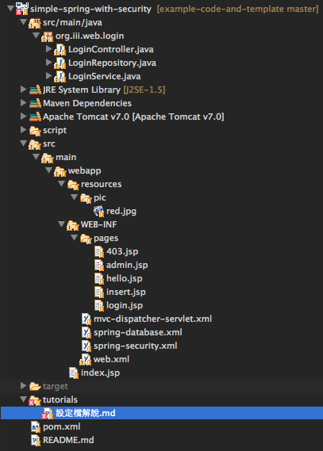

#資料夾結構說明
下圖為剛複製下來的時候，資料夾展開的樣子




依照上圖資料夾結構可分為幾個部分：

1. src/main/java
2. src -> main -> webapp -> resources
3. src -> main -> webapp -> WEB-INF
4. src -> main -> webapp -> WEB-INF -> pages

####src/main/java
這個部分是用來放置我們撰寫的 java 檔

至於撰寫的規則，會在另一篇 tutorial 中提到

請參考 `程式撰寫規則說明.md`

-------------------------------------------------------------------

####src -> main -> webapp -> resources
這部分的規定`並沒有被 Spring 強制`，但是我們約定好寫法以後會比較好歸納

唯一有規定的是：要`被跳脫 Spring 架構的檔案`，要放在此資料夾統一管理

（ 至於跳脫是什麼意思.... 請參考`設定檔說明.md` **web.xml 的 第五部分**）

* pic 
	* 表示放置圖片
	* 可以視需求在分更細的資料夾
* js
	* 放置 javascript 檔案
	* 在本樣板中並沒有使用到
* css
	* 放置 CSS 檔案
	* 在本樣板中也沒有使用到 ( 汗... )
	
使用的時候要怎麼用呢？我們截取了`insert.jsp`中的 15~18 行，作為示範：

```
<tr>
	<td> UserName:</td>
	<td><input type='text' name='username'></td>
</tr>
```

應該不難看出來，重點在於`src="resources/pic/red.jpg"`

要使用的時候路徑這樣打就可以了，因為 jpg 結尾的 request 已經被 web.xml 定義為要跳脫 Spring 架構

所以它可以`直接得到 jpg 檔`，`不會`被 controller 們 parsing ！！

以上，聰明的你一定會知道 JS 跟 CSS 要怎麼用，所以就不多說了ＸＤ

--------------------------------------------------------------------

####src -> main -> webapp -> WEB-INF
根據 java web 的規定，`web.xml` 一定要放在這裡

所以就導致`其他設定檔`也通通放在這裡了 囧

不過這樣也算整齊，所以就照規則放吧

其中比較特別的是 `index.jsp` ， 因為預設會去找那個位子的 index.jsp 所以才會放在那邊 囧

（ 如果要改就搜尋 web.xml + <welcome-file-list> 應該會有人教怎麼改 ＸＤ）

`pages`也是個特別的資料夾，在下一段會在做詳細介紹！

--------------------------------------------------------------------

#### src -> main -> webapp -> WEB-INF -> pages
基本上所有的 jsp 只要放在 webapp 資料夾底下都沒有問題

但是我們定義了所有 view 的路徑，以下截取 mvc-dispatcher-servlet.xml 13~21 行

```
<bean
	class="org.springframework.web.servlet.view.InternalResourceViewResolver">
	<property name="prefix">
		<value>/WEB-INF/pages/</value>
	</property>
	<property name="suffix">
		<value>.jsp</value>
	</property>
</bean>
```

不多說了，以上設定檔可以看出就是`一定要`放在 pages 資料夾底下... 然後`一定要`以 jsp 結尾

強烈建議，pages 底下要用功能來區分`放置 jsp 的資料夾`

不然最後 jsp 會很多很多很多 ...
